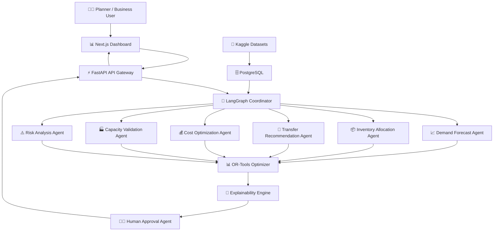
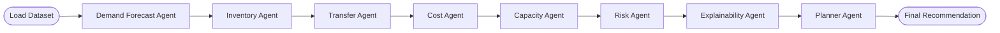
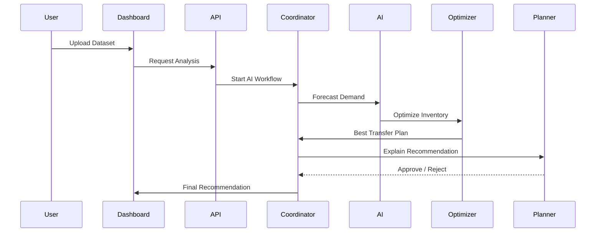
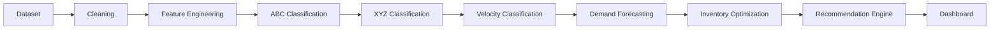
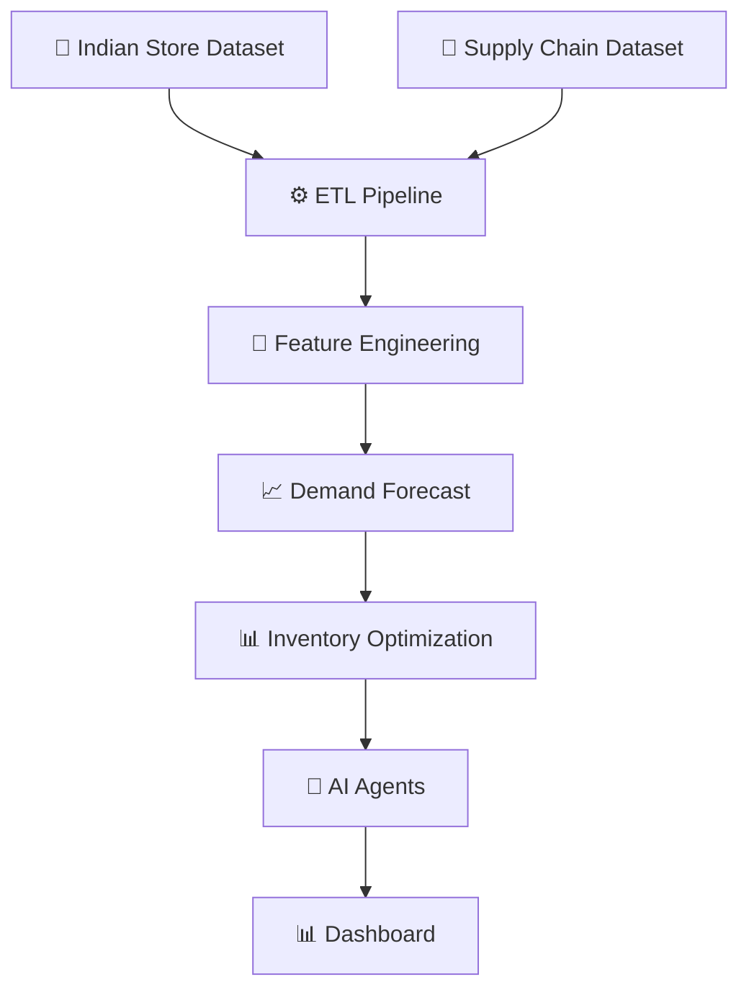
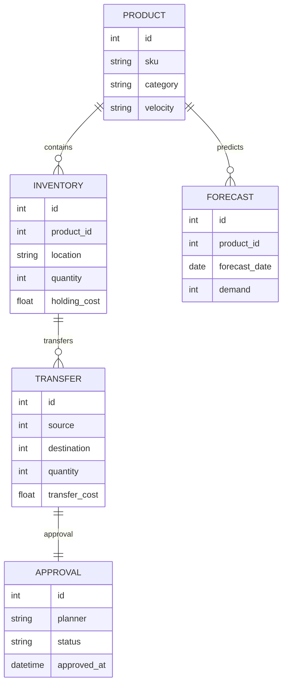

<div align="center">

# 🚀 NetworkIQ AI

### **Enterprise Multi-Agent Inventory Intelligence Platform**

#### *Intelligent Inventory Placement • Demand Forecasting • Transfer Optimization • Explainable AI*

<p align="center">
  


</p>


### 💡 Predict Smarter. Place Better. Deliver Faster.

</div>

---

# 📑 Table of Contents

- Executive Summary
- Problem Statement
- Why Current Systems Fail
- Our Solution
- Key Innovations
- System Architecture
- Multi-Agent AI Workflow
- Technology Stack
- Features
- Repository Structure
- Installation
- Contributors
- License

---

# 🌍 Executive Summary

Modern retail supply chains are becoming increasingly complex.

Large retailers manage inventory across multiple locations while trying to satisfy unpredictable customer demand.

Unfortunately,

inventory often exists **inside the network** but **not at the location where customers actually need it**.

This results in

- Lost Sales
- Poor Service Levels
- Excess Inventory
- Expensive Stock Transfers
- Low Inventory Utilization

NetworkIQ AI addresses these challenges by introducing an **Enterprise Multi-Agent AI Platform** that continuously analyzes historical sales, forecasts future demand, optimizes inventory placement, recommends stock transfers, and explains every decision before execution.

Unlike traditional inventory management systems, NetworkIQ AI combines

- Artificial Intelligence
- Machine Learning
- Operations Research
- Explainable AI
- Human-in-the-loop Decision Making

to deliver intelligent inventory optimization at the network level.

---

# 🎯 Problem Statement

Modern retail fulfilment networks often suffer from fragmented inventory planning.

Individual warehouses, stores, and planners optimize inventory locally without considering the entire network.

Consequently,

- High-demand locations experience stockouts.
- Slow-moving inventory occupies premium storage locations.
- Inventory transfers are reactive instead of proactive.
- Transfer costs increase unnecessarily.
- Customer delivery promises are missed.

The objective of NetworkIQ AI is to provide an intelligent, explainable, and scalable solution that recommends:

- Optimal inventory allocation
- Smart stock transfers
- Cost-effective replenishment
- Capacity-aware placement
- Planner-assisted execution

while balancing

- Demand
- Capacity
- Holding Cost
- Transfer Cost
- Service Level

---

# ❌ Why Existing Systems Fail

Traditional inventory planning systems rely on

- Static reorder rules
- Weekly planning reports
- Manual decision making
- Spreadsheet-based optimization
- Independent regional planning

These approaches lack

❌ Network-wide visibility

❌ Explainable recommendations

❌ Dynamic demand forecasting

❌ Intelligent transfer planning

❌ Human-AI collaboration

---

# 💡 Our Solution

NetworkIQ AI introduces a **Multi-Agent Inventory Intelligence Platform** where specialized AI agents collaboratively optimize inventory across the retail network.

Instead of relying on a single decision engine,

multiple AI agents independently analyze

- demand,
- inventory,
- transfer feasibility,
- capacity,
- cost,
- and business constraints

before negotiating towards a globally optimized inventory strategy.

Every recommendation is

✔ Explainable

✔ Auditable

✔ Capacity-aware

✔ Cost-efficient

✔ Human-approvable

which aligns directly with the hackathon problem statement.

---

# ✨ Key Innovations

### 🤖 Multi-Agent AI Architecture

Instead of one monolithic AI model,

NetworkIQ AI deploys specialized collaborating agents.

---

### 📈 AI-Powered Demand Forecasting

Predicts future SKU demand using historical sales patterns.

---

### 📦 Intelligent Inventory Allocation

Determines the optimal inventory level for each location.

---

### 🚚 Smart Transfer Recommendations

Suggests stock movement only when the expected business value exceeds transfer cost.

---

### 💰 Cost Optimization

Balances

- Holding Cost
- Transfer Cost
- Lost Sales
- Service Level

to maximize business value.

---

### 🧠 Explainable AI

Every recommendation includes

- Demand Basis
- Cost Trade-off
- Expected Savings
- Confidence Score
- Business Justification

ensuring complete transparency for planners.

---

### 👨‍💼 Human-in-the-Loop

High-value transfer plans require planner approval before execution, ensuring enterprise-grade governance.

---

# 🌟 Why NetworkIQ AI?

Unlike conventional inventory systems,

NetworkIQ AI combines

- Machine Learning
- Multi-Agent Systems
- Optimization Algorithms
- Explainable AI
- Human Decision Support

into a single enterprise platform capable of intelligent inventory planning across an entire retail network.

---

## 📊 Project Status

| Module | Status |
|---------|--------|
| Backend | 🚧 In Progress |
| AI Agents | 🚧 In Progress |
| Demand Forecasting | 🚧 In Progress |
| Inventory Optimization | 🚧 In Progress |
| Frontend Dashboard | 🚧 In Progress |
| Documentation | 🚧 In Progress |

---

> **"Turning distributed inventory into intelligent decisions through collaborative AI."**
---

# 🏗️ Enterprise System Architecture



---

# 🤖 Multi-Agent Workflow



---

# 🔄 AI Decision Pipeline



---

# 📈 Machine Learning Pipeline



---

# 🧠 AI Agent Responsibilities

| AI Agent | Responsibility |
|-----------|---------------|
| 🎯 Coordinator Agent | Controls complete workflow |
| 📈 Demand Forecast Agent | Predicts future SKU demand |
| 📦 Inventory Allocation Agent | Determines inventory allocation |
| 🚚 Transfer Agent | Generates stock transfer recommendations |
| 💰 Cost Agent | Calculates profitability & savings |
| 🏭 Capacity Agent | Validates warehouse constraints |
| ⚠️ Risk Agent | Detects stockout & overstock risks |
| 📄 Explainability Agent | Generates business reasoning |
| 👨‍💼 Planner Agent | Human approval workflow |

---

# ⚙️ Technology Stack

| Layer | Technology |
|---------|------------|
| Frontend | Next.js 15 |
| UI | Tailwind CSS + shadcn/ui |
| Charts | Recharts |
| Backend | FastAPI |
| Database | PostgreSQL |
| ORM | SQLAlchemy |
| AI Framework | LangGraph |
| Forecasting | LightGBM |
| Optimization | Google OR-Tools |
| Data Processing | Pandas |
| ML | Scikit-Learn |
| Deployment | Docker |

---

# 📊 Data Pipeline



---

# 📦 Repository Structure

```text
networkiq-ai/

├── frontend/
│
├── backend/
│
├── ai/
│   ├── agents/
│   ├── forecasting/
│   ├── optimization/
│   ├── explainability/
│   ├── orchestrator/
│   └── rag/
│
├── datasets/
│
├── docs/
│   ├── architecture/
│   ├── diagrams/
│   ├── screenshots/
│   └── api/
│
├── docker/
│
├── presentation/
│
├── tests/
│
├── scripts/
│
└── README.md
```

---

# 🗄️ Database Design



---

# 🔒 Enterprise Design Principles

- Multi-Agent Architecture
- Explainable AI
- Human-in-the-Loop
- Cost-Aware Decisions
- Capacity-Constrained Optimization
- Modular Microservice Design
- Scalable AI Workflow
- Production-Ready REST APIs
---

# 📸 Dashboard Preview

> **Note:** Screenshots will be updated as development progresses.

| Executive Dashboard | Demand Forecast |
|--------------------|-----------------|
|  |  |

| Transfer Recommendations | Inventory Heatmap |
|--------------------------|-------------------|
|  |  |

---

# 🎥 Demo

A complete walkthrough of the system is available below.

📹 **Demo Video**

```
(To be added before final submission)
```

---

# 📊 Key Features

## 📈 AI Demand Forecasting

Predicts SKU-level demand using historical sales patterns and machine learning.

---

## 📦 Intelligent Inventory Allocation

Optimizes inventory placement across multiple fulfillment locations.

---

## 🚚 Smart Transfer Recommendation

Suggests transfers only when

- Business value > Transfer cost
- Capacity constraints are satisfied
- Inventory remains balanced

---

## 🧠 Explainable AI

Every recommendation contains

- Business reasoning
- Demand basis
- Expected savings
- Cost trade-off
- Confidence score

---

## 👨‍💼 Human Approval Workflow

Large transfer plans require manual planner approval before execution.

---

## 📊 Executive Dashboard

Interactive dashboard showing

- Inventory Status
- Demand Forecast
- Transfer Suggestions
- KPI Analytics
- Approval Queue
- AI Insights

---

# 🚀 Getting Started

## Clone Repository

```bash
git clone https://github.com/<username>/networkiq-ai.git
cd networkiq-ai
```

---

## Backend Setup

```bash
cd backend

python -m venv venv

source venv/bin/activate

pip install -r requirements.txt

uvicorn main:app --reload
```

---

## Frontend Setup

```bash
cd frontend

npm install

npm run dev
```

---

## Docker

```bash
docker compose up --build
```

---

# 🌐 API Endpoints

| Method | Endpoint | Description |
|----------|----------|-------------|
| POST | /forecast | Generate demand forecast |
| POST | /optimize | Optimize inventory placement |
| POST | /transfer | Generate transfer recommendation |
| GET | /dashboard | Dashboard KPIs |
| GET | /inventory | Inventory status |
| POST | /simulate | Run what-if simulation |

---

# 📈 Business Impact

| KPI | Goal |
|------|------|
| Product Availability | ↑ Increase |
| Holding Cost | ↓ Reduce |
| Transfer Cost | ↓ Reduce |
| Inventory Utilization | ↑ Improve |
| Service Level | ↑ Improve |
| Stockouts | ↓ Reduce |

---

# 🛣️ Development Roadmap

- [x] Project Architecture
- [x] Data Pipeline
- [x] Feature Engineering
- [x] AI Agent Design
- [ ] Demand Forecasting
- [ ] Inventory Optimization
- [ ] Transfer Recommendation
- [ ] Dashboard Integration
- [ ] Planner Approval Workflow
- [ ] Deployment

---

# 📂 Project Modules

| Module | Status |
|---------|--------|
| Frontend | 🚧 |
| Backend | 🚧 |
| AI Engine | 🚧 |
| Forecasting | 🚧 |
| Optimization | 🚧 |
| Documentation | 🚧 |

---

# 🔐 Security

- JWT Authentication
- Input Validation
- SQL Injection Protection
- Environment Variables
- Role-Based Access (Roadmap)

---

# 📚 Datasets

### Indian Store Data
Used for sales, demand patterns, customer behavior, and product performance.

### High-Dimensional Supply Chain Inventory Dataset
Used for inventory levels, lead times, warehouse allocation, supplier information, and transfer optimization.

---

# 🤝 Contributors

| Name | Role |
|------|------|
| Team Lead | AI & Architecture |
| Member 2 | Backend Development |
| Member 3 | Frontend Development |

---

# 🙏 Acknowledgements

- Walmart Sparkathon 2026
- Kaggle Datasets
- Google OR-Tools
- LangGraph
- LightGBM
- FastAPI
- Next.js

---

# 📜 License

This project is developed exclusively for **Walmart Sparkathon 2026**.

For educational and hackathon purposes only.

---

<div align="center">

## ⭐ If you like this project, consider giving it a star!

**Built with ❤️ using AI, Machine Learning, and Operations Research**

**NetworkIQ AI — Predict Smarter. Place Better. Deliver Faster.**

</div>
